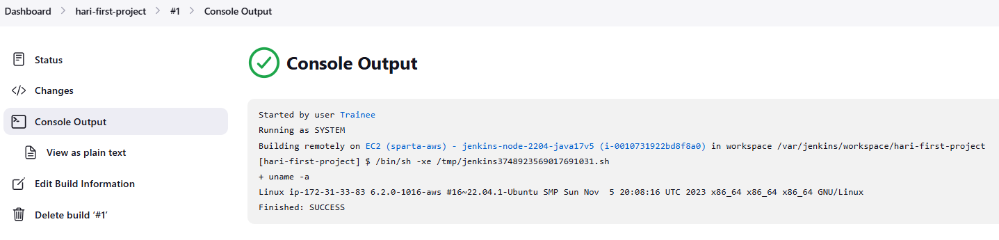
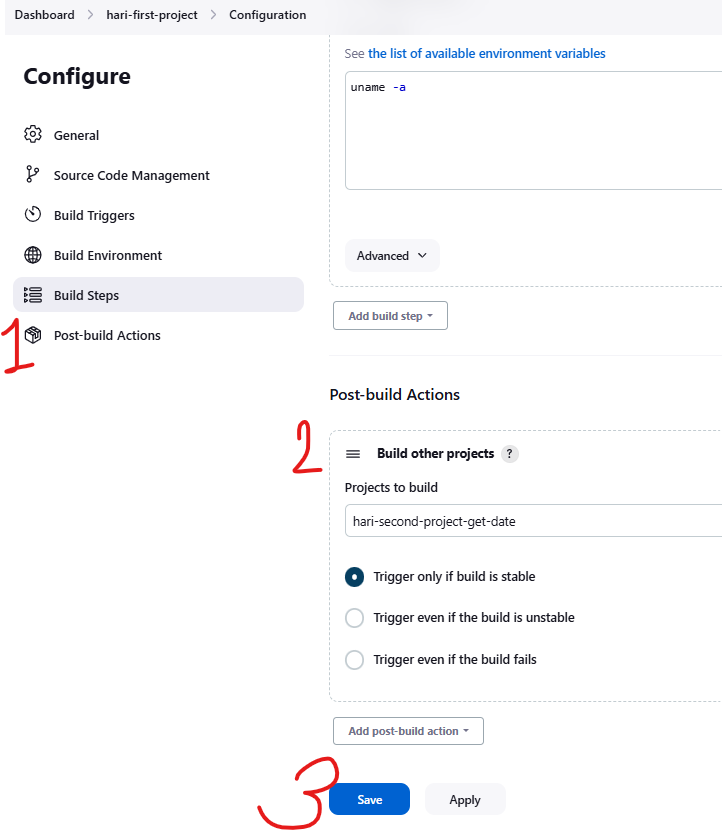
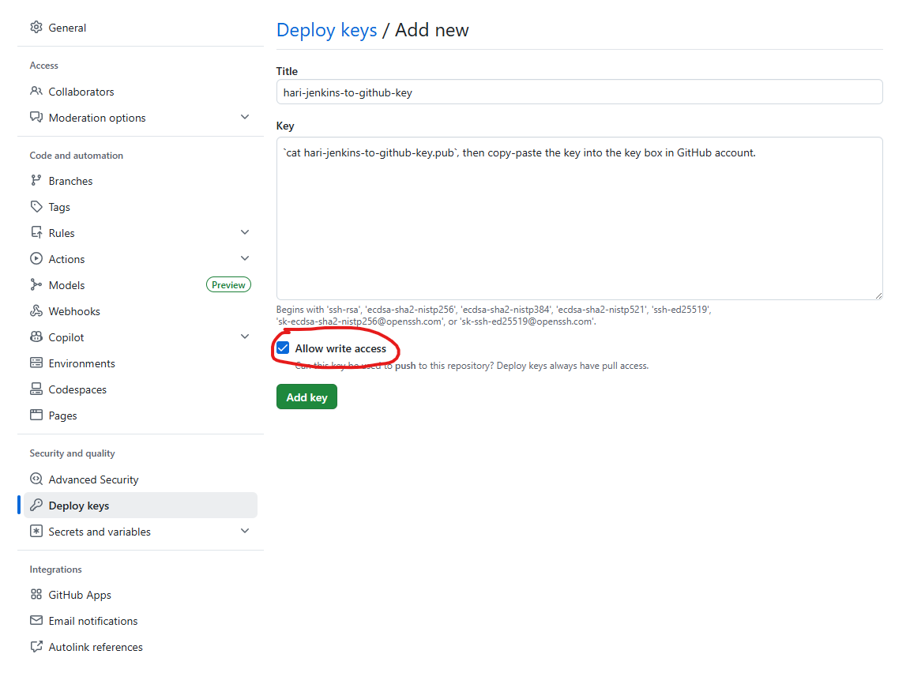
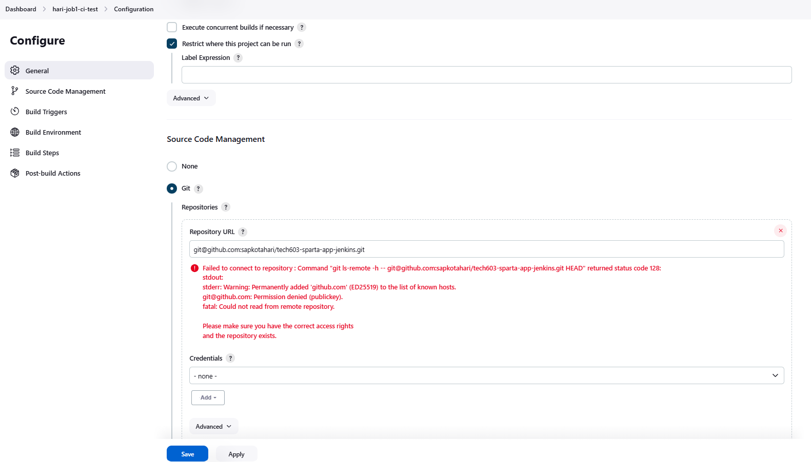
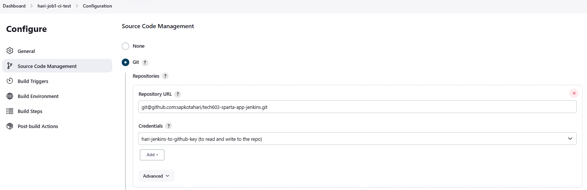

- [How to create projects with Jenkins (brief overview)](#how-to-create-projects-with-jenkins-brief-overview)
  - [Create](#create)
  - [Configure](#configure)
  - [Build Steps](#build-steps)
  - [Build Now =\> carries out stand-alone job](#build-now--carries-out-stand-alone-job)
  - [Link first with second project](#link-first-with-second-project)
- [3-job CI/CD Pipeline](#3-job-cicd-pipeline)
  - [Pre-requisites](#pre-requisites)
    - [1. Allow Jenkins to connect to GitHub](#1-allow-jenkins-to-connect-to-github)
    - [2. Set up webhook](#2-set-up-webhook)
  - [Create a project (Job 1) in Jenkins (CI - Test)](#create-a-project-job-1-in-jenkins-ci---test)
  - [Create Job 2 (CI - Merge)](#create-job-2-ci---merge)
  - [Create Job 3 (CD - Deploy)](#create-job-3-cd---deploy)
  - [Run the jobs using Jenkins CICD Pipeline](#run-the-jobs-using-jenkins-cicd-pipeline)


# How to create projects with Jenkins (brief overview)

## Create
1. New item
2. Item name: hari-first-project
3. Freestyle Project

## Configure
1. Description: testing jenkins
2. Check *Discard old builds*
3. Max # of builds to keep: 5

## Build Steps
1. Select Execute shell
2. In the Execute Shell box, write the command you want to execute. For e.g.:
`uname -a`
3. Save

## Build Now => carries out stand-alone job
* Select the project and click *Build Now*
* Once the job is complete, you can view the console output, which shows the commands run and the corresponding output. See below:


   


## Link first with second project

1. Configure
2. Post-build Actions
3. Build other projects > Select the next project
4. Select *Trigger only if build is stable*
5. Save




# 3-job CI/CD Pipeline

## Pre-requisites

### 1. Allow Jenkins to connect to GitHub


1. Create SSH Key for Jenkins to connect to  GitHub
   * Run `ssh-keygen -t rsa -b 4096 -C "hari.sapkota1@gmail.com"` in .ssh folder
   * Name: **hari-jenkins-to-github-key**
2. In GitHub, go to the repo > settings (settings for the repo, not for the whole account) > Deploy keys > *Add deploy key*
3. Title: **hari-jenkins-to-github-key** (SSH Key name used in Step 1)
4. Key: In local Terminal, print your **public key** (`cat ~/.ssh/hari-jenkins-to-github-key.pub`, then copy-paste the key into the key box in GitHub account (see the image below).
5. Check *Allow write access*

    


### 2. Set up webhook

Go to GitHub > Repo settings > Webhooks > Payload URL:

>http://public-ip-jenkins-server:8080/github-webhook/

## Create a project (Job 1) in Jenkins (CI - Test)

**This job runs tests after changes to the code in the dev branch.**

1. Jenkins *Dashboard* > *+ New Item*
2. Item name: hari-job1-ci-test
3. Freestyle Project
4. **General:**
   1. Description: run tests on the app code - triggered by git push
   2. Check Discard old builds
      * Max # of builds to keep: 5
   3. GitHub project: 
      * Project url: Copy the https url from the GitHub repo and paste it here.
5. **Source Code Management**: Connect to GitHub repo
   1. Choose *Git* and paste the **SSH URL** for your GitHub repo (get it from you GitHub account)
   3. As soon as you add the URL, you will see Permissions error message (see below). This is because you haven't added the credentials yet!

      

   4. Just below the error message, there is a *Credentials* drop-down list, and an *Add* option. You need to add credentials before it appears in the drop-down list.
   5. Click *Add* > *Jenkins*. Here, you add the **private key** from your "jenkins-to-github key"
   6. In the pop-up window that appears next:
      *  Domain: Global credentials (unrestricted)
      *  Kind: SSH Username with private key
         *  Scope: Global
         *  ID: **hari-jenkins-to-github-key**
         *  Description: Not required
         *  Username: **hari-jenkins-to-github-key**
         *  Private Key > Enter directly > Add
         *  Now, print your private key (ending with .pem) in your terminal and paste it in the *Key* box here.
         *  Passphrase: Not required
         * Click *Add*
  
             
   7. Branches to build: */dev
6. **Build Triggers:** Check GitHub hook trigger for GITScm polling
7. **Build Environment:**
   1. Check *Provide Node & npm bin/ folder to PATH*
   2. NodeJS Installation: NodeJS  version 20
   3. The rest are left deafult
8. **Build Steps:**
   1. *Add build step* > Select *Execute shell*
   2. Add the following commands to the box:
      ```
      cd app
      npm ci # similar to npm install but more suited to this system
      npm test
      ```
9. **Post-build Actions:**
   * Option 1: Do nothing
   * Option 2: Set it up so that completion of this job triggers the second job in the pipeline.
10. Click *Save*
11. To test this job runs succesfully, find this job from the Dashboard and click *Build Now*


## Create Job 2 (CI - Merge)

**This job merges the dev branch into the main branch following successful completion of tests in Job 1.**

Generally, the steps to set up any project are very similar. You  need to pay attention to things such as:
* whether or not git push should trigger this job
* what git branches need to be accessed
* what trigger should kick start this job
* what service will this job access and what credentials are required
* what is the job that this step carries out - write appropriate command in the *Execute shell* box
* Any Post-build Actions?

I will only include here the steps that are different from Job 1.

1. **Source Code Management**
   1. Branches to build:
      1. */dev
      2. */main
2. **Build Triggers**
   1. Check *Build after other projects are built*
      * Projects to watch: hari-job1-ci-test
      * Check *Trigger only if build is stable*
3. **Build Environment**
   1. Check *Provide Node & npm bin/ folder to PATH* > NodeJS version 20 (as in Job 1)
   2. Check *SSH Agent*
      * Follow the steps to Add Credentials from Job 1 above to add private aws key here.
4. **Build Steps:** Only if you're not using Git Publisher in the Post-build Actions to merge
   1. *Add build step* > Select *Execute shell*
   2. Add the following commands to the box:
      ```bash
      git fetch origin

      git checkout -B main origin/main

      git merge origin/dev

      git push origin main
      ```
5 **Post-build Actions:**
   * You can choose to link this to the next job in the pipeline.
   * Do *git merge* (recommended way as opposed to adding commands in Step 4):
     * Select *Add post-build action* > *Git Publisher*
       * Check *Push Only If Build Succeeds*
       * Check *Merge Results*
       * Branches:
         * Branch to push: main
         * Target remote name: origin
         > This is because you're doing:
         > 
         > dev  ---> merged into ---> main
         > 
         > Then pushing:
         > 
         > main ---> GitHub


## Create Job 3 (CD - Deploy)

**Following successful completion of jobs 1 (testing) and 2 (merging), this step deploys the app with updated code to the EC2 instance, so the users can start using the updated version straight way.**

Steps to *Configure*:

1. **Source Code Management**
   1. Branches to build:
      1. */dev
      2. */main
2. **Build Triggers**
   1. Check *Build after other projects are built*
      * Projects to watch: hari-job2-ci-merge
      * Check *Trigger only if build is stable*
3. **Build Environment**
   1. Check *Provide Node & npm bin/ folder to PATH* > NodeJS version 20 (as in Job 1)
   2. Check *SSH Agent*
      * Add jenkins-to-github private key
      * Add aws private key
4. **Build Steps:** Only if you're not using Git Publisher in the Post-build Actions to merge
   1. *Add build step* > Select *Execute shell*
   2. Add the following commands to the box:
      ```bash
      scp -o StrictHostKeyChecking=no -r app ubuntu@54.247.226.20:~

      ssh -o StrictHostKeyChecking=no ubuntu@54.247.226.20 << 'EOF'

      cd app
      
      npm ci
      
      pm2 delete app &> /dev/null || true
      
      pm2 start index.js --name app
      
      EOF
      ```
5. **Post-build Actions:** Not required

## Run the jobs using Jenkins CICD Pipeline

Make required changes to the app code in your local *dev* branch and push to remote *dev*. This action will kickstart the CICD pipeline we just set up.

**First run:**


**Second run:**


