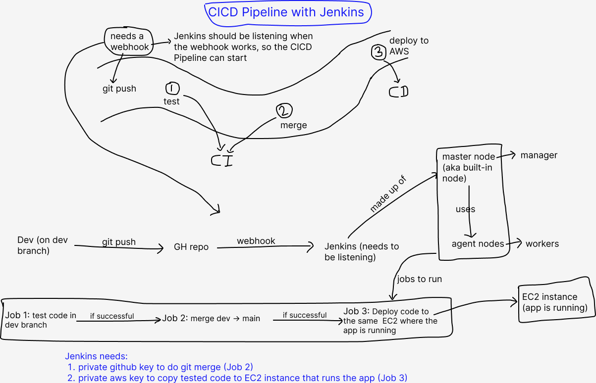

- [Intro to CI/CD and Jenkins](#intro-to-cicd-and-jenkins)
  - [What is CI? Benefits?](#what-is-ci-benefits)
  - [What is CD? Benefits?](#what-is-cd-benefits)
  - [What is Jenkins?](#what-is-jenkins)
  - [Benefits and Disadvantages](#benefits-and-disadvantages)
  - [Stages of Jenkins CICD Pipeline](#stages-of-jenkins-cicd-pipeline)
  - [Alternatives to Jenkins](#alternatives-to-jenkins)
  - [Business Value of implementing a CICD Pipeline](#business-value-of-implementing-a-cicd-pipeline)
  - [Implementing CICD Pipeline with Jenkins](#implementing-cicd-pipeline-with-jenkins)

# Intro to CI/CD and Jenkins

## What is CI? Benefits?

* Continuous Integration
* merging code
* Triggered by:
  * Developers pushing changes to shared repo
* Tests are run automatically on the code before being integrated into the main code

**Benefits**

* near instant feedback after pushing the code
* Help you to identify and resolve bugs early
  * reduce costs
  * save time
* Help to maintain a stable and functional software build

## What is CD? Benefits?

**CD can mean:**

* Continuous Delivery (manual sign off/approval)
* OR Continuous Deplopyment (automatically deploys code to production)

**Continuous Delivery (manual sign off/approval)**

* ensure software is always in a deployable state, ready/ can be pushed to production at any time
* often involves producing deployable artifact
* requires a manual release decision
* **Benefit:**
  * always have a deployable artifact ready to go

**Continuous Deplopyment**

* extends Continuous Delivery by automating the final step of deploying to production
* no manual intervention required
* **Benefit** which is also a disadvantage:
  * removes the need for human approval, relies entirely on automated processes

## What is Jenkins?

* automation server
* open-source
* primary used for CICD, but can automate much more

## Benefits and Disadvantages

**Benefits**
* Automation
* Extensibility: has over 1800 plugins
* Scalability: Jenkins server can scale easily by adding/using woker nodes/agents to jobs
* Community support
* Cross-platform: Windows, Linux, MacOS

**Disadvantages**
* Can be complex due to a range of functinality available
* Maintenancy overhead: bug in any plugins can have an impact on the entire workflow
* Can be resource-intensive when running multiple jobs
* User interface: can feel a bit outdated, cluttered!

## Stages of Jenkins CICD Pipeline

1. Source Code Management (SCM)
2. Build: Compile the code, build into executable artifact
3. Test: Automated tests (unit, integration, etc.)
4. Package: Package into deployable artifact
5. (If using Continuous Deployment) The package is deployed into the target environment e.g. test, production
6. (If using Continuous Deployment) Monitor: Monitoring tools may be deployed/configured to observe performance, log issues, etc. after deployment

## Alternatives to Jenkins

* GitLab CI
* GitHub Actions
* Circle CI
* Travis CI
* Bamboo
* TeamCity
* GoCD
* Azure DevOps (Azure Pipelines to run CICD pipeline)

## Business Value of implementing a CICD Pipeline

* cost saving - automating repetitive processes
* faster time to market
* reduced risk
* Scalability: no matter how complex the programme is, it can grow (implement new features) and still be stable
* improved quality: tests by the Dev team, test by CICD, and feedback from the users sooner too
  

## Implementing CICD Pipeline with Jenkins

1. Create GH repo with the app code
2. Add public key to GitHub account to secure your repo (within repo settings)
3. Set up a webhook to run Job 1 (test code pushed to dev branch)
   1. Set up SSH access to GitHub (add private key to Jenkins; part of the public key used above)
4. Job 2: if Job 1 successful, merge dev code to main
5. Job 3: if Job 2 successful, deploy code to EC2 app instance
   1. Set up Jenkins access to your AWS

 

